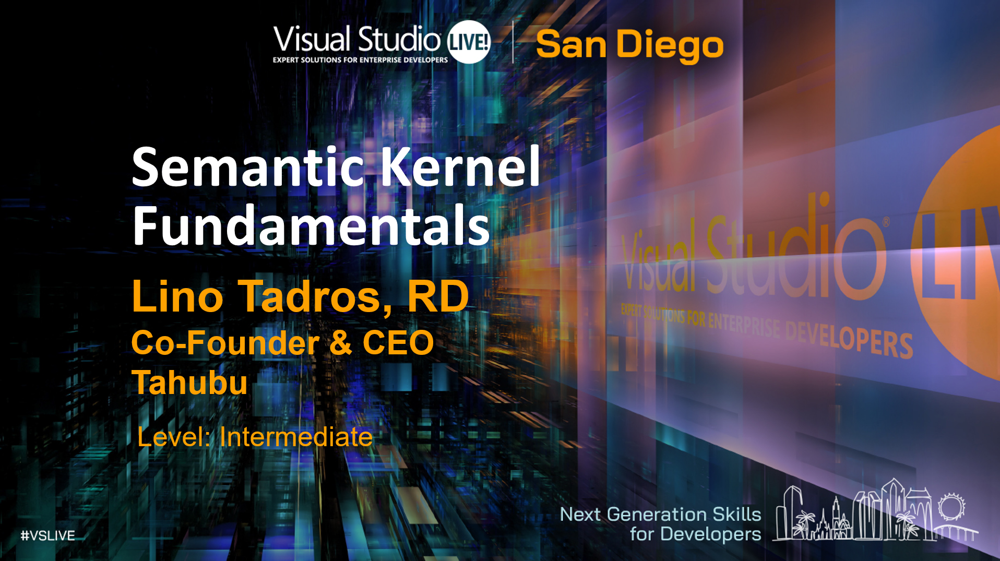

# Semantic Kernel Fundamentals Presentation

This is the presentation that was presentated at VSLive 360 in San Diego in September of 2025

To follow along, rename the file `appsettings.sample.json` in most of the projects to `appsettings.json` and use your own endpoints and apikeys.   

## To watch 5+ hours of videos on the subject, head to YouTube for free access to the @LinoTadrosTV channel
[Semantic Kernel Playlist](https://youtube.com/playlist?list=PLyqwquIuSMZpGDiocmT-M67dcDxjWmoYK&si=5yAsxeuLikd33Bz6)

