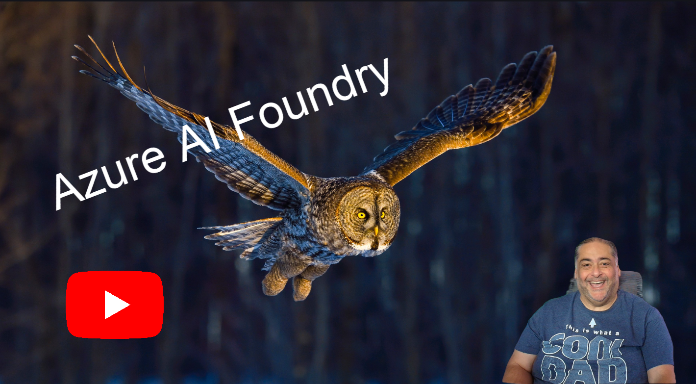

# Mastering Azure AI Foundry with Agents Seminar
### VS Live 360 Seminar for Mastering Azure AI Foundry with Agents

[Videos playlist for Azure AI Foundry](https://www.youtube.com/playlist?list=PLyqwquIuSMZqpk8GWbSFMwtHWpopBBnR_)

[Videos playlist for Semantic Kernel](https://www.youtube.com/playlist?list=PLyqwquIuSMZpGDiocmT-M67dcDxjWmoYK)

## Day 1:

| Time | Description |
|-------|-------------|
| 9:00 to 10:00 | Introduction to Azure AI Foundry and Setup |
| 10:00 to 10:30 | Lab for setup Azure AI Foundry Project |
| 10:30 to 10:40 | Break |
| 10:40 to 11:30 | Azure AI Foundry Embedding and Vectorization  |
| 11:30 to 12:00 | Lab  |
|12:00 to 1:00 | Lunch |
|1:00 to 1:45 | Azure AI Foundry with Text, Audio and Vision  |
|1:45 to 2:30 | Lab |
|2:30 to 2:45 | break |
|2:45 to 3:15 | Introduction to Semantic Kernel |
|3:15 to 3:45 | Lab |
|3:45 to 4:30 | Monitoring and evaluations |
|4:30 to 5:00 | Lab and Wrap up |

## Day 2

| Time | Description |
|-------|-------------|
| 9:00 to 10:00 | Agent Creation and concepts |
| 10:00 to 10:30 | Lab |
| 10:30 to 10:40 | Break |
| 10:40 to 11:30 | Access Azure AI Agents from Semantic Kernel |
| 11:30 to 12:00 | Lab  |
|12:00 to 1:00 | Lunch |
|1:00 to 1:45 | Building MCP Servers |
|1:45 to 2:30 | Lab |
|2:30 to 2:45 | break |
|2:45 to 3:15 | Building MCP Clients |
|3:15 to 3:45 | Lab |
|3:45 to 4:30 | Real life example of running a resort with multiple agents |
|4:30 to 5:00 | Lab and Wrap up |
